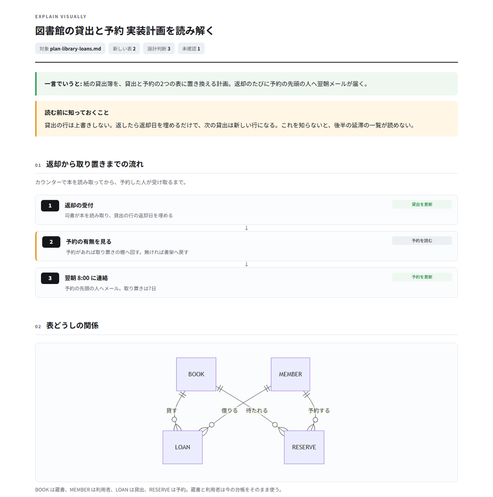
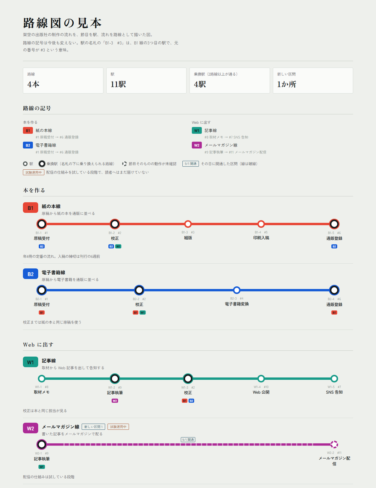
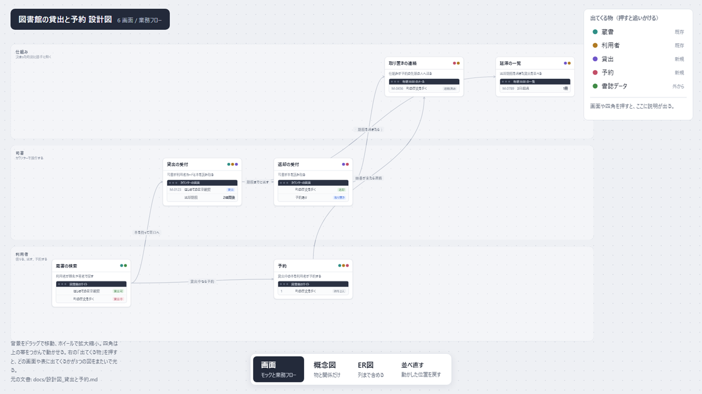
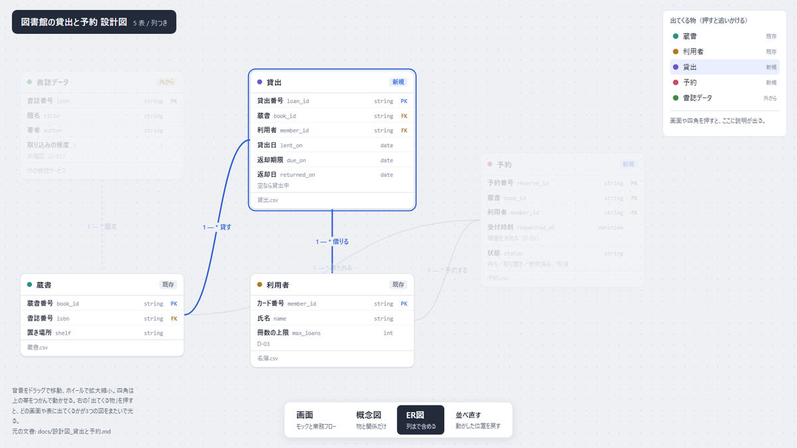
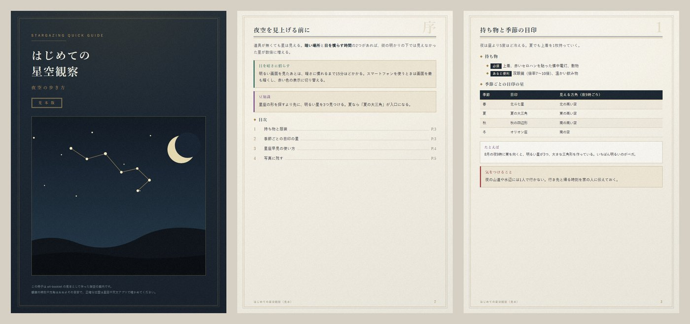

# html-skills

HTML を正本にして、読むためのページや印刷物を作る Claude Code 用の Skill 集。
どの Skill も、書き出した結果をヘッドレス Chrome で実際に描画し、数や枚数を機械で確かめてから渡す作りになっている。

## 入っている Skill

| Skill | 作る物 | 呼ぶときの言い方の例 |
|---|---|---|
| explain-visually | 長い設計文書や実装計画を、図と短い文で読み解く1枚の解説ページ | 「/explain-visually 計画.md」 |
| rosenzu | 長い流れを路線、節目を駅として描く路線図 | 「処理の流れを路線図にして」 |
| sekkeizu | 業務フロー、概念図、ER図を切り替えて見る設計図 | 「作る前に設計図を作って」「ER図にして」 |
| bg-pdf | 装飾背景を敷いた1枚ものの A4 PDF | 「この画像を背景にした案内状を PDF で」 |
| a4-booklet | 挿絵入りの A4 冊子の PDF | 「ルール要約を挿絵入りの冊子にして」 |

explain-visually は明示して呼んだときだけ動く。他の4本は、依頼の言い方から Claude が選ぶ。

## 作れる物の見本

どの見本も架空の題材で、各 Skill の雛形から書き出した物である。

### explain-visually

実装計画を、要約、処理の流れ、表の関係図、識別子つきの設計判断に分けて1枚にする。



### rosenzu

長い流れを路線、節目を駅として描く。幅 1280 と 375、明と暗の4通りで崩れないことを撮影して確かめる。



### sekkeizu

同じ入力から、画面と業務フロー、概念図、ER図の3つを切り替えて見る。右の一覧で物を選ぶと、3つの図をまたいで光る。





### bg-pdf

背景の画像を9分割で敷き、画面でも印刷でも枠が歪まない1枚ものを作る。


### a4-booklet

表紙、目次、本文の章を1ページずつ組む A4 の冊子。PDF とページごとの画像を出す。



## 入れ方

Claude Code で、このリポジトリをマーケットプレイス（プラグインの配布元）として登録してから入れる。

```bash
claude plugin marketplace add shikigami-ai-works/claude-html-skills
claude plugin install html-skills@html-skills
```

入れずに1回だけ試すなら、複製したフォルダを起動時に渡す。

```bash
claude --plugin-dir ./claude-html-skills
```

1本だけ使う場合は、`skills/<名前>/` のフォルダを `~/.claude/skills/` かプロジェクトの `.claude/skills/` に複製する。

## 要る物

| 物 | 使う Skill |
|---|---|
| Google Chrome か Chromium 系のブラウザ（Windows では Edge でもよい） | 全部 |
| Python 3.10 以上 | explain-visually、rosenzu、sekkeizu、a4-booklet |
| Node.js 18 以上 | rosenzu（撮影） |
| Pillow | a4-booklet（撮影と分割）、bg-pdf（背景素材の縮小） |
| NumPy | bg-pdf（背景素材の実測） |
| ネット接続（Mermaid と Google Fonts を CDN から読む） | explain-visually、a4-booklet |

Chrome は既定の場所と PATH から自動で探す。見つからないときは環境変数 `CHROME_PATH` に実行ファイルの場所を入れる。

## 試し方

各 Skill の見本は架空の題材で、そのまま書き出せる。

```bash
python skills/rosenzu/template/build_rosenzu.py skills/rosenzu/template/sample.json --selftest
python skills/sekkeizu/template/build_sekkeizu.py skills/sekkeizu/template/sample.json --selftest
```

動作を確かめた環境は Windows 11 だけである。macOS と Linux 向けの処理（Chrome の探し方、プロセスの止め方）は書いてあるが、実機ではまだ試していない。

## 許諾

MIT License（`LICENSE`）。

explain-visually は [keitakn/engineering-skills](https://github.com/keitakn/engineering-skills) の同名の Skill（MIT License）を元に直した物である。元の著作権表示は `skills/explain-visually/LICENSE` に、直した所は `skills/explain-visually/NOTICE.md` にある。
